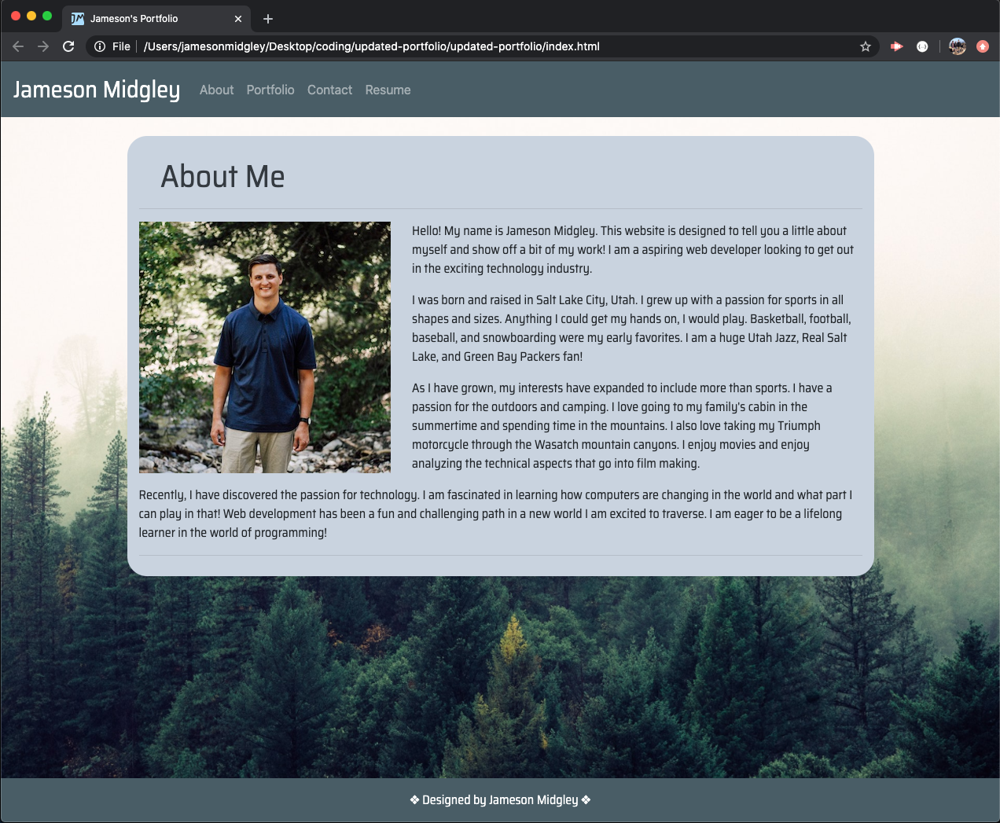
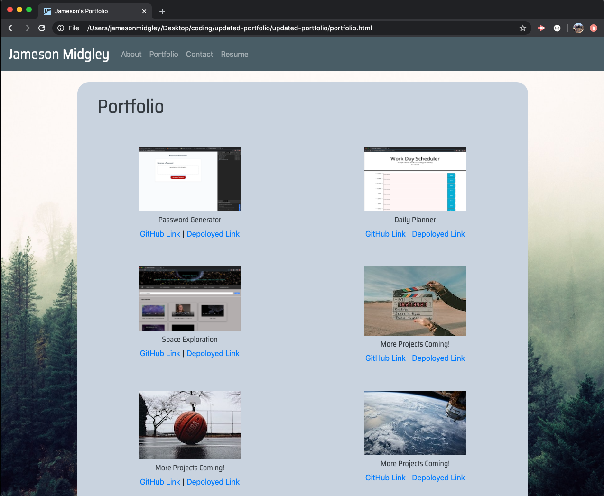
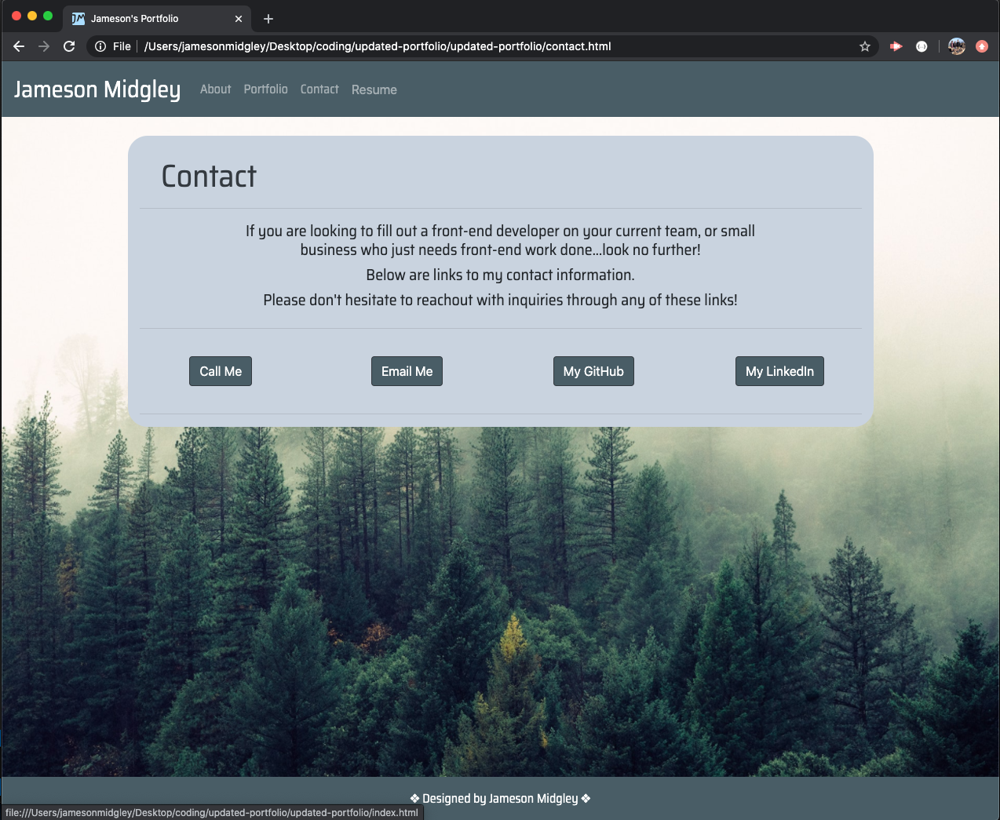
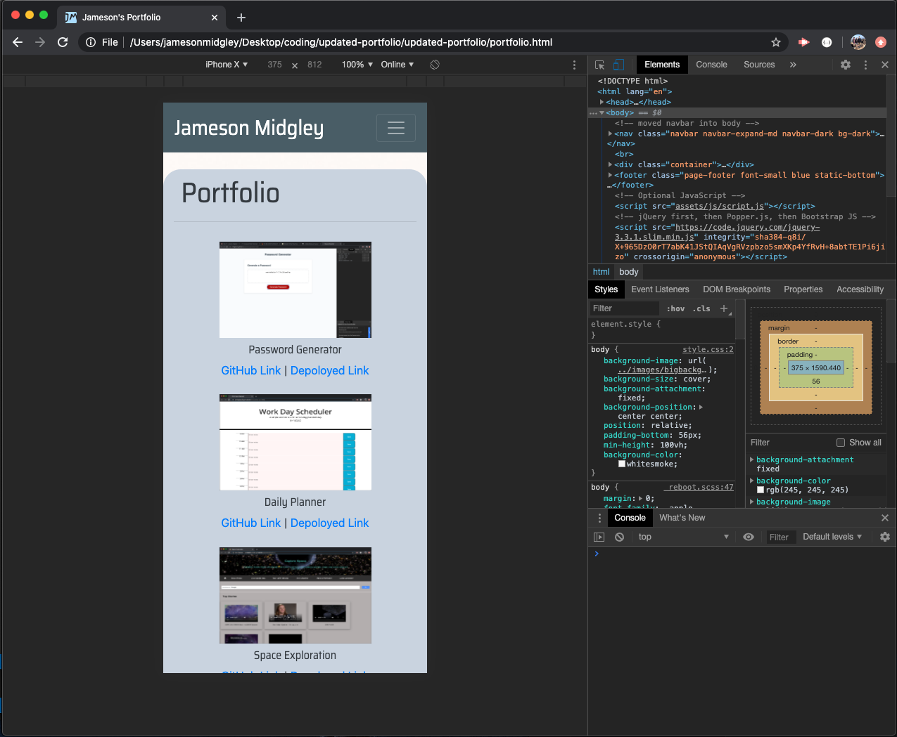

# portfolio-hw2

Introduction
--------------
This assignment was designed for us to update the code and design of our portfolio page using more of the skills we have learned since week 2. We also needed to add links to our first project and a few assignments as well.

Objective
--------------
* My objective in this is to creat a deployed website portfolio that is mobile responsive.
* I need to have a consistent navbar with links to Home, Contact, and Portfolio pages.
* I must have valid and correct HTML pages with semantic tags. Must have my personalized information.
* I must complete this portfolio using bootstrap components and the grid system.
* I need to update the portfolio page to display a picture and link to completed project and assignments. 
* I need to include a PDF of my resume.
* I need to update my Contact information and include my GitHub and LinkedIn pages.
* I need to update my GitHub and LinkedIn profiles.

Summary
--------------
I completed all of my objectives were completed in this assignment. I spent most of my time styling the website to make it look more like my own. It was extremely interesting to look back after all these weeks and see the choices I made back then, and why I made them. This was a great assignment to learn how to fix up something you have already done.

Screenshots and Links
---------------

[Link to updated portfolio](https://j-midgley13.github.io/updated-portfolio/)

 

 

 

 

